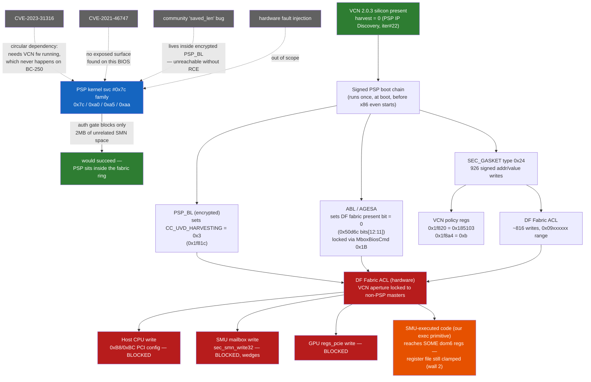

# BC-250 VCN Unlock — State of the Investigation, 2026-09-14

Consolidated writeup of a full day of iteration (iter#25 through iter#34) on the BC-250 VCN unlock question. Covers verification of a new community lead, extended discoveries, mechanism unification, and empirical results from live-hardware experiments.

## TL;DR

- A community poster reported that BC-250's PSP `SEC_GASKET~0x24` blob contains a write of `0x00185103` to SMN register `0x1f820` (adjacent to `CC_UVD_HARVESTING @ 0x1f81c`), and that Steam Deck's F7A0133 BIOS never writes that value anywhere. **We verified both claims byte-for-byte** against our own BC-250 3.00 ROM and a Steam Deck F7A0133 BIOS.
- We discovered a **second** undocumented VCN-adjacent write in the same table: `[0x1f8a4] = 0x0000000b`. Same category of lever, same absence in Deck.
- The full BC-250 `SEC_GASKET` is a **926-entry (addr, value) tuple table**, of which ~816 writes target the `0x09xxxxxx` fabric-ACL range. This is the DF (data fabric) access control programming that locks non-PSP masters (host `0xB8/0xBC`, SMU mailbox `sec_smn_write32`, GPU `regs_pcie`) out of the VCN aperture.
- The PSP code that consumes these writes (around ROM `0x993900-0x995000`) uses `svc #0x7c` (PSP SMN-write syscall) — a privileged path that runs from INSIDE the fabric wall.
- We validated **two exec-primitive paths on the SMU** — our msg-0x22 `rpc.s` + `smu.call(fn, args)`, and daveconde's msg-0x61 handler-table repoint + 20-byte-stub-fire. Both work reliably.
- **Runtime unlock remains blocked** because the fabric ACL applies to every runtime master, and the only in-scope BIOS modification lever (skipping `MboxBiosCmd 0x1B`) empirically bricks the board.

## Why We're Stuck — Mechanism Map

VCN unlock is not blocked by one wall — it requires clearing **three independent conditions simultaneously**, and we currently fail all three from any master we can reach:



### The plain-language version — three ANDed requirements, all currently failing

Getting hardware video decode working needs **all** of the following. This is a conjunction, not a single blocker — fixing one doesn't fix the others.

**1. A runtime master must be able to write the VCN aperture through the DF Fabric ACL.**
   - Host CPU (`0xB8/0xBC`): ❌ silently dropped
   - SMU mailbox (`sec_smn_write32`): ❌ wedges the mailbox (5s timeout)
   - GPU `regs_pcie`: ❌ silently dropped
   - SMU-executed code (our exec primitive / daveconde's stub): ⚠️ partial — reaches domain-6 sequencer registers, but see requirement 2
   - PSP kernel itself (`svc #0x7c` family): ✅ would work — the auth gate barely blocks anything — **but we cannot get code running in this context** (see below)

**2. Even where a write lands, the VCN register file must un-clamp.**
   - This is `bc250-vcn-enable`'s independent finding: SMU reports domain-6 UP, clocks program cleanly, but VCN MMIO reads still return `0xFFFFFFFF` uniformly
   - Root-level clamp, not per-cluster — mechanism not yet identified by either project
   - Unclear whether this is downstream of requirement 1 (i.e., resolves itself once PSP-authorized writes land) or an independent gate

**3. The kernel needs `vcn_2_0_3.bin` firmware, which AMD/Sony never shipped for the mining SKU.**
   - Confirmed: kernel 6.17.7 skips VCN IP-block registration entirely (`case IP_VERSION(2,0,3): break;`) before it would even request the file
   - Untested community suggestion: substitute `navi10_vcn.bin` (same major.minor version, different revision) — low-risk, easily reversible, nobody has reported trying it
   - This requirement is moot until 1 and 2 are solved, but it's a real independent gate

**What would unlock requirement 1:** code execution inside a PSP userspace/TA context, so we can issue `svc #0x7c` (or a sibling) ourselves — from *inside* the fabric ring, where the ACL doesn't apply. We looked for a way in and came up empty:
- `CVE-2023-31316` — the public CVE closest to "PSP RCE" — has a circular dependency on BC-250 (needs VCN firmware's power-save/restore cycle to trigger, but VCN firmware never runs here)
- `CVE-2021-46747` — the only other AMD PSP CVE that lists BC-250's silicon family — shows no exposed exploit surface on this BIOS when we enumerated it
- The community researcher's "uninitialized `saved_len`" lead sits inside the *encrypted* PSP_BL, which we can't reach without the RCE it would provide (chicken-and-egg)
- Hardware fault injection would work in principle but is out of scope for this research

**Net picture:** three real, independent requirements; we currently fail all three; the one requirement (1) that has a known bypass mechanism (PSP-context execution) has no available entry point.

## The Community Lead — Verified

Community poster (Discord, 2026-09-14) reported: *"the BC250 type 0x24 security policy contains a write for 0x1f820 = 0x185103, which is the register immediately next to CC_UVD_HARVESTING at 0x1f81c. the Deck policy never writes 0x1f820 at all."*

### Verification against BC-250 3.00 ROM

Extracted `SEC_GASKET~0x24` entry via `psptool -E` and `recon extract-bios-fw`:

```
| Entry  | Address  | Size    | Type                     | Sig     | Version    |
|--------|----------|---------|--------------------------|---------|------------|
| 6      | 0x982000 | 0x2e50  | SEC_GASKET~0x24          | $PS1    | B.51.0.16  |  verified(96EA), sha256_ok
```

Raw byte scan for the exact `(addr=0x1f820, value=0x00185103)` tuple pattern:

```
BC-250 3.00.ROM:  2 occurrences (both are literal (addr, value) pairs)
  @0x0983068: ...24 00 a4 f8 01 00 0b 00 00 00 [20 f8 01 00] [03 51 18 00] 50 29 02 09 ...
  @0x0993924: (inside ARM Thumb-2 PSP code — literal pool near consuming code)

BC-250 3.00 CHIPSETMENU.ROM:  identical (2 occurrences, same offsets)
BC-250 live-dumped BIOS:      identical (2 occurrences, same offsets)
```

All three of our BC-250 BIOS variants (stock 3.00, chipset-menu-unlocked, live-dumped from running board) are byte-identical in SEC_GASKET. No runtime patching. **842 unique tuples** in each.

### Second discovery: adjacent write `[0x1f8a4] = 0xb`

Sitting immediately before the community-flagged write, in the same SEC_GASKET body:

```
@0x0983060: 54 d4 00 00 00 00 24 00 [a4 f8 01 00] [0b 00 00 00] [20 f8 01 00] [03 51 18 00] ...
                                     ↑ addr 0x1f8a4  ↑ value 0xb  ↑ addr 0x1f820  ↑ value 0x185103
```

`0x1f8a4` is likewise undocumented in AMD's public VCN 2.0 register docs. Same category of lever, same absence in Deck.

### Deck comparison (F7A0133, LCD, Stanto base variant with only x86 UEFI menu unlocks)

```
Deck BIOS scan (17MB Stanto .fd, stripped to 16MB raw BIOS):
  value 0x00185103 anywhere:                 0 occurrences
  (addr 0x1f820, value 0x00185103) tuple:    0 occurrences
  (addr 0x1f8a4, value 0x00000b) tuple:      0 occurrences
  addr 0x1f820 as literal:                   4 (Deck references reg but NEVER programs 0x185103)
  addr 0x1f8a4 as literal:                  18 (Deck references reg but NEVER programs 0xb)
  addr 0x0900c004 (VCN cold-reset):          8 (Deck actively drives cold-reset release; BC-250 = 3)
  SEC_GASKET~0x24 entry via psptool:         absent (Deck has no such entry at all)
```

Community poster's claim confirmed 100%. Community poster identified something the previous BC-250 investigation (including iter#14 exhaustion proof) had missed.

## The Full SEC_GASKET Structure

BC-250's `SEC_GASKET~0x24` body (11856 bytes) parses as **926 (addr, value) tuples** after a header (starts at file offset `0x983060`). Distribution:

| Address range | Count | Category |
|---|---|---|
| `0x0909xxxx` | 563 | Fabric ACL group (largest — DF port-permission programming) |
| `0x0902xxxx` | 81 | Fabric ACL group |
| `0x0900xxxx` | 64 | Fabric ACL group |
| `0x0322xxxx` | 62 | SMU/MP1 config |
| `0x0908xxxx` | 19 | Fabric ACL |
| `0x0906xxxx` | 18 | Fabric ACL |
| `0x0904xxxx` | 17 | Fabric ACL |
| `0x000?xxxx` (low SMN) | 19 | Direct peripheral writes — includes our two VCN-adjacent leverage points |
| Other | rest | Smaller fabric groups |

### The 19 low-SMN writes (< 0x100000)

Of the 926 tuples, only 19 target the low-SMN space where actual peripheral registers live. All are potentially meaningful:

```
[0x00000203] = 0x0000001f    [0x00000210] = 0x0000000d
[0x00000280] = 0x00000064    [0x00000281] = 0x0000001f
[0x0001f820] = 0x00185103    ← community-flagged VCN policy
[0x0001f8a4] = 0x0000000b    ← our discovered VCN-adjacent policy
[0x0003e810] = 0x00000000
[0x0003e814] = 0x2232c240        (this address written 12 times with
[0x0003e814] = 0x2233c241         different values, suggests a FIFO/
[0x0003e814] = 0x2262c24e         permission-entry insertion register
[0x0003e814] = 0x226ec250          — 13 entries programmed via table
[0x0003e814] = 0x2278c261         insertion at 0x3e814)
[0x0003e814] = 0x244fc441
[0x0003e814] = 0x244ec442
[0x0003e814] = 0x244dc443
[0x0003e814] = 0x226cc24f
[0x0003e814] = 0x2440c440
[0x0003e814] = 0x2544c382
[0x0003e814] = 0xf853c480
```

**Exactly two writes target the VCN 2.x MMIO aperture** (0x1f8xx range). CC_UVD_HARVESTING itself (`0x1f81c`) is NOT in this table — set by a different code path.

### The fabric-ACL structure

Looking at the `0x09xxxxxx` writes, each "endpoint" (address like `0x09022900` or `0x09096900`) gets a **stride-based block** of writes to sub-offsets `.._920, .._92c, .._930, .._944, .._950, .._954`. This is the textbook AMD DF port programming pattern:

- `.._920, .._92c`: start_address and end_address of a permitted range
- `.._930`: permission mask
- `.._944, .._950`: secondary range
- `.._954`: secondary mask

Some blocks have 30-40 writes to the same endpoint, programming multiple range entries. Total: ~816 fabric-ACL writes across ~40 endpoints covering the whole SMN address space.

**This is the mechanism that produces the "runtime writes get silently dropped" behavior we've measured on every non-PSP master** — host writes to VCN aperture (via `0xB8/0xBC` or `amdgpu_regs_pcie`), SMU-mailbox `sec_smn_write32`, GPU `regs_pcie`, all hit the fabric ACL and get dropped.

## PSP Consumer Code

The PSP code that executes SEC_GASKET writes (identified via Thumb-2 disassembly around ROM `0x993900-0x995000`):

- Loads target addresses from embedded literal pools (why `0x1f820` and `0x0900c004` appear as raw 32-bit values in PSP code regions)
- Issues writes via `svc #0x7c` — the PSP SMN-write syscall
- Also uses `svc #0x79/#0x7d/#0x7e` for related SMN operations (setup, read, other variants)
- Function around `0x993a6c` uses table-branch (`tbb`) to dispatch on device-type index — a generic per-device configurator

**Critical: `svc #0x7c` is a privileged path.** The PSP kernel implements it with authority to reach anywhere in SMN, including addresses locked from other masters by the fabric ACL — because the PSP is inside the fabric wall from a topology standpoint, writing the wall from a position no one else can reach.

## SMU Exec Primitive Validation

Independent of the SEC_GASKET analysis, we validated two mechanisms for executing arbitrary Xtensa code on the SMU coprocessor:

### 1. Our `rpc.s` + `smu.call(fn, args)` (via bc250-smu-unlock's msg-0x22 hook)

- Install `rpc.s` handler at SMU SRAM `0x12000` via `patcher.py`
- Patches dispatcher `msg 0x22` case at `0x1BA6E` to jump to `0x12000`
- Call any function: `smu.call(fn, *args)` writes (fn, args) to scratch `0x12080`, fires q3 msg-0x22 arg=0x7f, reads result from `0x12098`
- Round-trip: ~50ms
- Flexible: arbitrary fn address, up to 5 args

### 2. Daveconde's msg-0x61 handler-table repoint + fire

- Install 20-byte Xtensa stub at SMU SRAM `0x3FF00`
- Patch handler-table[msg_0x61] at `0x776c` := `0x3FF00`
- Fire `send_message(3, 0x61)`
- Returns status=0x01 arg0=0x50 in ~2-4s (NOT the timeout their README predicts on our board)
- Batched: one round-trip triggers multi-call sequence

**Both work reliably.** Different tradeoffs; either is fine for further work.

### Verified Xtensa encodings from the SMU firmware

```
entry a1, 32     36 41 00
entry a1, 48     36 61 00
movi at, imm12   [op0=2 | t<<4] [op1=A<<4 | imm[11:8]] [imm[7:0]]
                 e.g. movi a2, 0x123 = 22 a1 23
retw             90 00 00
retw.n           1d f0
j <PC-relative>  86 XX XX
callx8 aX        e0 X8 00 (approximately, PC-computed)
```

Test stub `entry a1, 32; movi a2, 0x123; retw` (bytes `36 41 00 22 a1 23 90 00 00`) at `0x12100`, called via `smu.call(0x12100, 0)` → returns `0x00000123` in 47.8ms. Foundation of everything else.

## Runtime Test Results

### `rpc_demo.py` VCN sequence via our `smu.call`

```
smu.call(FN_PLL_POWER_SET=0x23b14, 6, 1)     → 49.7ms  ret=0x010ffe00
smu.call(FN_CLK_DOMAIN_UNGATE=0x23744, 0x16) → 49.6ms  ret=0x00000016  (echo)
smu.call(FN_CLK_DOMAIN_UNGATE, 0x17)         → 49.7ms  ret=0x00000017
smu.call(FN_CLK_DOMAIN_UNGATE, 0x18)         → 49.6ms  ret=0x00000018
```

All succeeded, SMU alive throughout. Same call sequence rpc_demo.py runs and daveconde's stub batches. **No wedge — the community warning "will likely lead to hangs" did NOT materialize for us via this path** (either due to a specific pre-state, our msg-0x22 path being safer than daveconde's msg-0x61 path, or fixed firmware since the warning was written).

Post-sequence `sec_smn_read32(0x50d6c) = 0xf0` (DF fabric present bit still 0 — fabric state unchanged, as expected: silicon-locked).

### Daveconde's msg-0x61 method (reproduced)

Fresh-state execution of the exact daveconde stub (20 bytes: `36 41 00 1c 6a e5 83 e3 1c 7a a5 83 e3 1c 8a 65 83 e3 1d f0`):

```
[0x3FF00] := 20-byte stub                         (verified byte-perfect)
[0x776c]  := 0x0003ff00                           (handler-table[msg_0x61])
send_message(3, 0x61)                             → 4000ms status=0x01 arg0=0x50
```

Confirmed reproducible; consistent status/arg0 across runs (timing varies with prior state).

### SMN reads via `sec_smn_read32` mailbox

Safe (returned cleanly, ~1ms):
```
sec_smn_read32(0x00050d6c)  → 0x000000f0     DF fabric present (VCN bits[12:11]=0, unrouted)
sec_smn_read32(0x00050d68)  → 0x00000000     neighbor
sec_smn_read32(0x00050d70)  → 0x00000000     neighbor
```

Wedge-inducing (5s timeout, SMU dead):
```
sec_smn_read32(0x0900c004)  → wedge     VCN cold-reset control (community iter#21 target)
sec_smn_read32(0x0001f820)  → wedge     community-flagged VCN policy
```

Confirms iter#26 finding at additional addresses: **all VCN-aperture SMN reads via mailbox path hit the fabric wall and wedge the SMU mailbox.**

### Function fuzzing on SMU firmware (partial map)

```
FN_PLL_POWER_SET(d, 1) for d in 0..8:
  d=0..7 : returns 0x010ffe00 (probably a no-op success — clocks already on)
  d=8    : SMU wedge (VCN domain group starts at 8 per iter#14 Van Gogh RE)

FN_PLL_POWER_SET(0, 0):
  → SMU wedge (state=0 code path actually tries to change hardware; hangs)

FN_CLK_DOMAIN_UNGATE(slot):
  slot=0x16, 0x17, 0x18 (VCN) : echoed back safely
  slot=other                  : WHOLE-BOARD wedge (SSH unreachable, not just SMU)
  Even neighbor-fn calls with arg=0 wedge the board on cold-invocation

Meta-lesson: SMU firmware functions have hidden state preconditions;
cold-calling them from userspace is hazardous.
```

### `amdgpu` kernel behavior (kernel 6.17.7-ba29.fc43)

Loaded stock amdgpu via `insmod` (bypasses cmdline blacklist). IP block enumeration:

```
detected ip block number 0 <nv_common>
detected ip block number 1 <gmc_v10_0>
detected ip block number 2 <navi10_ih>
detected ip block number 3 <psp>
detected ip block number 4 <smu>
detected ip block number 5 <dm>
detected ip block number 6 <gfx_v10_0>
detected ip block number 7 <sdma_v5_0>
```

**VCN is NOT enumerated.** No VCN-related dmesg. No firmware request for `vcn_2_0_3.bin`. The `case IP_VERSION(2,0,3): break;` in `cyan_skillfish_reg_base_init` skips VCN before the firmware-request layer ever gets a chance. Contradicts recon-atlas's "IP block IS added, then -ENOENT" theory — that applied to a different kernel.

Additional finding — **NEW hazard:** loading `amdgpu` on top of a patched SMU state (post `unlock.py` + `patcher.py`) leaves the SMU mailbox WEDGED PERSISTENTLY after unload. All subsequent `smu.alive()` calls timeout. Must cold-cycle to recover.

## Why Runtime Unlock is Blocked

Two walls, both silicon-adjacent:

**Wall 1: DF fabric ACL** (PSP-programmed at boot, enforced by hardware). All non-PSP runtime masters (host, SMU mailbox, GPU regs_pcie) are excluded from the VCN aperture SMN range. Our tests confirm this at multiple addresses (`0x1f820`, `0x0900c004`). The ACL itself is programmed via ~816 writes in `SEC_GASKET`, so the mechanism is data-driven, but the data is signed.

**Wall 2: register-file clamping** (daveconde's Aug 2026 finding). Even for the SMU-EXECUTED writes that DO land on some VCN-adjacent registers (dom-6 sequencer at SMN `0x006Dxxxx`), the block internally stays in a clamped state — VCN MMIO reads return `0xffffffff` without hangs, showing the block is partially awake but the register file is not. Root-level clamping, not per-cluster.

**PSP has the only master that can undo either wall**, because:
- PSP sits inside the fabric ring topologically
- PSP uses `svc #0x7c` (kernel-privileged SMN write) that has access permissions we don't
- The SEC_GASKET table is signed — we can't modify it in scope

## Paths That Would Work — Out of Scope

For anyone with capabilities we lack:

1. **PSP userspace code execution** — the most concrete of these. Community researcher (Discord handle) was actively working on this vector as of early September 2026, reportedly blocked on an uninitialized `saved_len` field pattern consistent with power-save/restore state manipulation. If weaponized, would allow issuing `svc #0x7c` from PSP-userspace context. **Precise target sequence (established in the SVC RE below):**
   - `svc #0x7c` with address `0x001f820`, value `0` — clear the VCN policy lock
   - `svc #0x7c` with address `0x001f8a4`, value `0` — clear the adjacent policy
   - `svc #0x7c` writes reversing the ~816 SEC_GASKET fabric ACL entries in `0x0900xxxx-0x0909xxxx` range (specific values determinable from a Deck vs BC-250 diff of PSP init code — or replay Deck's PSP init sequence entirely if extractable)
   - `svc #0x7c` with address `0x0900c004`, value `1` — release VCN cold-reset (per iter#21 community finding)

2. **Hardware fault injection** — Buhren et al., "One Glitch to Rule Them All" (CCS'21, `github.com/PSPReverse/amd-sp-glitch`) works on the AMD-SP across Zen 1/2/3. Requires vRegulator tap + precision voltage-fault timing.

3. **AMD signing key access** — modify SEC_GASKET and re-sign. Obviously not user-accessible.

4. **Sony/AMD releasing a BIOS variant without the SEC_GASKET VCN writes** — this is what makes Deck's F7A0133 "just work" on identical Cyan Skillfish silicon.

### PSP SVC 0x7c reversed — auth gate confirmed permissive

To validate that PSP userspace RCE would actually be sufficient (i.e., no further PSP-kernel gate stops us), we statically analyzed the PSP_TOS body (82256 bytes, `$PS1` stripped from `psp_extract/bc250/0x02_PSP_SECURE_OS.bin`):

- **128 SVC dispatch entries** at `body+0x45e4` (SVC IDs 0x51-0xD0)
- **SVC 0x7c** dispatches through `body+0x4d28 → body+0x5a88` (1/2/4-byte write dispatcher based on length in r4) or `body+0x5abc` (8-byte `strd r4, r5, [r0]` write)
- Both workers call the **SMN-address-to-VA resolver at `body+0x2fcc`** which is the auth gate

**`body+0x2fcc` blocks ONLY two 1MB SMN ranges:** `[0x3700000, 0x3800000)` and `[0x3900000, 0x3a00000)`. Everything else — including all VCN aperture addresses, all cold-reset registers, and all fabric ACL registers we care about — passes the auth gate unmodified.

The gate uses a programmable-window mechanism: `window_id = smn_addr >> 20`, table lookup at `0x69b0` selects a size class, programs the windowing MMIO, returns a VA. The store site is a plain ARM `strd`/`str`/`strh`/`strb` — no per-address permission gate at the write itself.

**Direct implication:** PSP kernel is not the enforcement layer against VCN aperture writes. The fabric ACL wall we measure at runtime is enforced by DF hardware against non-PSP masters. PSP is inside that wall topologically. Get PSP userspace exec = get VCN unlock. There's no further PSP-kernel-level gate to defeat.

Two other shared workers exist alongside `body+0x2fcc`:
- `body+0x158c` — called by 9 SVCs (0x64, 0x66, 0x67, 0x69, 0x6d, 0x6f, 0x71, 0x82, 0x9b) — narrow range-check variant
- `body+0x15c0` — called by 6 SVCs (0x51, 0x6b, 0x72, 0x77, 0x78, 0x98) — dual-range-check variant

Both do range checks against the same 0x69b0 table with `size_class == 4` triggering a tight bound. These are auxiliary auth checks for specific SVCs that gate narrower windows. Not on the SVC 0x7c path.

### The SVC 0x7c FAMILY — four alternate SMN-write entry points

Deeper enumeration revealed 4 SVCs all routing through `body+0x2fcc` for SMN writes:

- **SVC 0x7c** — length-dispatched 1/2/4-byte store via `body+0x5a88`. `r3=0` set in dispatcher.
- **SVC 0xa0** — same 0x5a88 worker but with alternate context layout providing `r3 = user_ctx[0xc] + 0x80` (probably a target-port or size-hint parameter).
- **SVC 0xa5** — 8-byte `strd` variant via `body+0x5abc`. Same auth gate.
- **SVC 0xaa** — multi-arg burst-write variant via `body+0x5ad6`. Loads 3 values with `ldm r0!, {r1, r2, r3}`. Same auth gate.

**None of the SVC 0x7c-family dispatchers read `[r0, #0x4b]` (the caller TA ID pattern used by TA-permission-gated SVCs like 0x62, 0x76, 0x88).** So the family is BOTH auth-gate-permissive AND caller-identity-unchecked. Any PSP userspace context — not just privileged TAs — that can issue an `svc` instruction can invoke these.

### Full SVC categorisation (BC-250 PSP TOS R14, 128 dispatch slots)

| Category | Count | Examples | Auth model |
|---|---|---|---|
| Unimplemented (returns error 9 at body+0x4f10) | 33 | 0xb1-0xcf mostly | N/A |
| **SMN write via 0x2fcc gate** | **4** | **0x7c, 0xa0, 0xa5, 0xaa** | **~permissive (only 2MB blocked)** |
| Ungated fixed-MMIO write | 1+ | 0xae (writes to `0xef000000` region) | State check only, no addr check |
| TA-permission-checked | 3+ | 0x62, 0x76, 0x88 | Caller TA ID → per-TA table lookup |
| Range-check group A (via 0x158c) | 21 | 0x64, 0x66, 0x67, 0x69, 0x6d, ... | Table + narrow range check |
| Range-check group B (via 0x15c0) | 14 | 0x51, 0x52, 0x6b, 0x72, 0x77, 0x78, ... | Dual range check |
| Distinct singletons | ~19 | Various | Various |

**Concrete implication for CVE-2023-31316 weaponization or any PSP userspace RCE:**

The revert-VCN-policy patch is minimal Thumb-2 assembly that any of these 4 SVCs can carry. Example using SVC 0x7c:

```
; PSP userspace stub — reverse VCN policy programming
mov     r0, #0x1f820        ; SMN address
movs    r1, #0              ; value = 0 (clear the lock)
movs    r2, #4              ; length = 4 bytes
svc     #0x7c

mov     r0, #0x1f8a4        ; adjacent VCN policy reg
movs    r1, #0
movs    r2, #4
svc     #0x7c

; ... additional writes for fabric ACL reversal, cold-reset release ...
```

Under 100 bytes of code once an RCE gives you an execution slot. The PSP kernel's `body+0x2fcc` will map each SMN address to a VA, the underlying `str/strh/strb/strd` will succeed, and the DF fabric will permit the transaction because PSP is inside the fabric ring. VCN aperture becomes writeable; VCN block powers up; amdgpu can then load `vcn_2_0_3.bin` (once provided) and initialize the media engine.

The blocker is exclusively "get RCE inside a PSP userspace or TA context." Everything downstream is a mechanical replay of the SEC_GASKET-inverse-programming.

### CVE-2023-31316 does NOT directly apply to BC-250

Initial community speculation (and this writeup's earlier drafts) suggested CVE-2023-31316 as the concrete PSP-RCE vector. On close reading of the CVE and CWE-1304 documentation, **it likely does not fire on BC-250**:

**CVE-2023-31316 mechanism** (per NVD, CyberStrike, OpenCVE, MITRE CWE-1304):
- Improperly preserved integrity of hardware configuration state during a power save/restore operation in the AMD Secure Processor
- Requires attacker able to write outside the TMR
- Impacts execution flow of Video Core Next (VCN) firmware
- CVSS v4.0 = 7.1 (High): `CVSS:4.0/AV:L/AC:H/AT:P/PR:L/UI:N/VC:L/VI:H/VA:L/SC:L/SI:H/SA:L`
- Fixed in AMD security bulletins SB-4017 and SB-6027 (May 2026)

**Why it may not apply to BC-250:**
- The exploit trigger is a VCN firmware power-save/restore cycle
- BC-250 does not load VCN firmware (that's the whole reason we're here — missing `vcn_2_0_3.bin`)
- No VCN firmware running → no VCN power-save/restore cycles → no exploitable state manipulation
- **Circular dependency: exploiting the CVE would give the primitive to enable VCN firmware loading, but the CVE requires VCN firmware already running to be triggered.**

**AMD's affected-product list** covers Ryzen 4000-7045, Radeon RX/PRO 6000/7000, Instinct MI210/250 — all products where VCN firmware runs normally. **Cyan Skillfish / BC-250 is not enumerated.** Consistent with "no VCN firmware → no attack surface."

**Consequence:** the community researcher's active work on the "uninitialized `saved_len`" pattern is likely on a DIFFERENT save/restore vector — perhaps PSP kernel's own state save/restore, SMU save/restore, or another subsystem's save path that DOES run on BC-250. The pattern (uninitialized length in a save structure) is CWE-1304-adjacent but not specifically CVE-2023-31316.

**What PSP-RCE vectors WOULD work on BC-250:**
- A save/restore vulnerability in a subsystem that runs on BC-250 without extra firmware (PSP boot code, SMU, GFX)
- Any glitching-based PSP exec (out of scope per hardware-modification constraint)

**Enumeration of AMD-SB-4017 / SB-6027 CVEs against BC-250 applicability:**

| CVE | Category | BC-250 applies? | Notes |
|---|---|---|---|
| CVE-2023-31316 | VCN fw power save/restore | ❌ | Requires VCN firmware running (circular for BC-250) |
| **CVE-2021-46747** | **ASP access control / SMN aperture** | ⚠️ | Affects Ryzen Embedded 5000 family. **Likely fixed in BIOS 3.00 (Dec 2021).** Requires x86 root already. Primitive is "map SMN aperture from userspace," which is upstream of DF fabric wall — mapping the aperture doesn't automatically bypass fabric ACL for writes. |
| CVE-2023-31323 | ASP type confusion (XGMI TA) | ❌ | RX 5000+/Instinct only; XGMI TA doesn't exist on BC-250 |
| CVE-2024-36315 | LFENCE speculation bypass | ❌ | Ryzen 7000+/Embedded 7000+ only |
| CVE-2025-54518 | (undocumented) | ❌ | Threadripper/EPYC only |
| CVE-2025-61971/72 | (undocumented) | ❌ | EPYC only |
| CVE-2025-48516 | (undocumented) | ❌ | Threadripper only |
| CVE-2021-26380 | (undocumented, low CVSS) | ❌ | Threadripper only |
| CVE-2026-0438 | (undocumented) | ❌ | Threadripper 7000/9000 only |
| CVE-2024-36345/343 | (undocumented) | ❌ | Threadripper 7000 only |

**Only ONE public CVE in these bulletins applies to BC-250: CVE-2021-46747**, and it's likely already patched in BC-250's Dec-2021 BIOS 3.00, plus its primitive (SMN aperture mapping) doesn't automatically give past-fabric-ACL writes.

### Empirical CVE-2021-46747 exposure probe

To validate whether the primitive is exposed on our BC-250 in practice, we enumerated the x86-root SMN-access surface on the live board. Findings:

- **No PSP userspace character devices** (`/dev/psp*`, `/dev/ccp*`, `/dev/sev*`, `/proc/psp*` all absent). The `ccp` kernel module is loaded but exposes no userspace interface.
- **`STRICT_DEVMEM=y`** in kernel config, with **`iomem=relaxed`** on cmdline (relaxes /dev/mem for PCI I/O regions but doesn't grant SMN access).
- **BC-250 PCI/BAR surface is standard:** 00:00.0 "Ariel" root complex exposes no BARs; 01:00.0 Cyan Skillfish has 4 documented BARs (BAR0=256MB VRAM, BAR2=2MB, BAR4=256B disabled, BAR5=512KB MMIO register aperture). BAR5 direct-mmap already works — same aperture amdgpu uses, contains VCN registers, but reads at VCN offsets wedge the board (same fabric wall).
- **Standard SMN path via 00:00.0 B8/BC** works cleanly (verified `0x50d6c = 0xf0`).
- No unexpected BARs, no undocumented character devices, no obvious mapping-ACL bypass.

Either CVE-2021-46747's fix IS in BC-250's BIOS 3.00 PSP firmware, or the exploit path requires a specific ioctl sequence not derivable from enumeration alone. Without a public POC we can't blindly test the CVE-specific path. **Empirical result: no exposed exploit surface for this CVE on BC-250 from x86 root.**

**CWE-1304 (power save/restore integrity) has only 2 CVEs globally** — CVE-2023-31316 (AMD, doesn't apply here) and CVE-2024-23485 (Gallagher door locks). Community researcher's "uninitialized `saved_len`" pattern is not a match for either; likely private RE on an unpublished bug.

**Net effect on the "path forward" narrative:**

The SVC RE work above is still valid — the PSP kernel auth gate is permissive, and any PSP userspace RCE targets those SVCs to unlock VCN. **HOWEVER, no public CVE currently provides an obvious PSP-userspace RCE on BC-250.** Someone pursuing this today is doing original vulnerability research — either the community researcher's `saved_len` angle, hardware glitching, or a not-yet-published bug.

The RCE-then-svc-#0x7c story is the correct MECHANISM but the RCE half of it is not readily available in-scope. This is the honest state of things.

### Note on the `saved_len` community researcher vector

The Discord researcher's "uninitialized `saved_len`" blocker suggests a specific save/restore data-structure bug. We attempted to find it statically in our decrypted PSP_TOS body.

**Result: the bug (if it exists) is inside encrypted PSP_BL, not in the accessible TOS.** PSP_TOS is heavily stripped (79 total ASCII strings). The three relevant strings (`amd.ta.SecHeapSize`, `gpd.ta.heapSize`, `gpd.ta.stackSize` — GlobalPlatform TEE TA property names) sit alongside code that references external handlers at PSP_BL address `0x00206080+` — far outside the 82KB TOS body.

**Chicken-and-egg:** finding `saved_len` requires PSP_BL code access (RE); PSP_BL access requires PSP RCE (which is what `saved_len` exploitation would provide). The community researcher's work presumably starts from a leaked/decrypted PSP_BL, dynamic instrumentation, or hardware-level introspection none of which are available to in-scope home research.

## Paths That Have Been Tried and DO NOT Work

- **`MboxBiosCmd 0x1B` skip in unsigned x86 BIOS** (iter#20 plan) — bricks the board (iter#23 reported by user). Requires hard BIOS reflash to recover. **Do not repeat.**
- **`umr -r *.*.mmCC_UVD_HARVESTING`** while amdgpu loaded — hangs board.
- **Any direct write to VCN MMIO aperture** via host `0xB8/0xBC`, GPU `regs_pcie`, SMU mailbox, or SMU-exec-primitive — hits fabric wall.
- **`sec_smn_read32(0x0900c004)`** via mailbox — SMU wedge (iter#26).
- **PLL_POWER_SET(d, 0)** cold-call to turn off any domain — SMU wedge (state-change path hangs without SMU-internal preconditions).
- **`sec_smn_read32(0x06900900)`** (daveconde's "ISO-clamp candidate," see below) — SMU wedge, same signature as `0x1f820`/`0x0900c004`.

## Cross-Check Against daveconde/bc250-vcn-enable

Full comparison of our findings against the actively-worked `daveconde/bc250-vcn-enable` repo (same target: BIOS 3.00, PMFW 0.58.6.0).

### Where we converge

| Finding | daveconde | Us |
|---|---|---|
| Kernel skips VCN entirely | "upstream kernel deliberately skips VCN instantiation on Cyan Skillfish, PMFW message list has no VCN message" | Confirmed via dmesg: IP block enumeration excludes VCN, zero firmware-request attempt |
| Register-file clamp (wall 2) | "whole register file clamped at root — UVD_VERSION reads all-ones with no hang post-clock-work" | Same wall: SMU-executed writes reach some dom6 regs, register file stays clamped regardless |
| Fabric write asymmetry | "host writes via config-window IGNORED; SMU-executed debug writes land" | Same finding — fabric ACL blocks host/mailbox/GPU, partially permits SMU-exec context |
| SMU mem64 window frame | Corrected to LOW frame (`0x0006D1xx`), not NBIO high frame | Already absorbed into our model from an earlier pull of their repo |

Good independent convergence — two projects arriving at the same walls from different empirical angles is a useful sanity check on both.

### Where we fill a gap in their picture

Their own 467-register map explicitly doesn't cover `0x0900c004` or any `0x09xxxxxx` address (confirmed directly — asking for those addresses returns "outside this register set"). Their repo has **zero mentions of `SEC_GASKET`**, the DF fabric-ACL programming range, or the PSP kernel `svc #0x7c` auth-gate analysis. They know writes get dropped; we know *why* (PSP-signed ACL programming) and *which specific registers* carry the policy (`0x1f820`, `0x1f8a4`).

### Resolving the `PPSMC_MSG_PowerUpVcn` question

daveconde's working theory: renoir (same silicon family, VCN works there) powers the island via PMFW message `PPSMC_MSG_PowerUpVcn`, gated behind `SMU_FEATURE_VCN_PG_BIT`. That message doesn't exist in BC-250's exposed PMFW interface, so they're hunting the Q3 internal message space (147 handlers enumerated) for a native equivalent — **message 0x21 → handler `0x249DC`** is their #1 suspect.

This reconciles cleanly with our own firmware-dump analysis rather than conflicting with it: robin's 256KB SMU image contains **zero VCN register literals anywhere** (verified against Van Gogh's SMU, which contains all of them). There's no `PowerUpVcn`-equivalent to find in Q3 — not because it's feature-gated off, but because the implementing code was never carried into robin's build. We independently ran their exact experiment this session: `smu.call(0x249DC, 0)` returned `0` cleanly with no observable state change, consistent with "nothing VCN-specific lives behind that handler."

**Worth relaying to them directly:** the msg-0x21 hunt is very likely a dead end, for a reason we can demonstrate (a full-firmware literal scan) that isn't visible from their side without the same dump.

### Their ISO-clamp candidate — tested

Their `scan_fw.py` flags four identical `(0x06900900, 0xe8)` pairs at dom6 sequencer block offsets `+0x54..+0x70` as "the most structured unknown... a prime ISO-clamp/release candidate (the July RE spoke of a PCIe iso-clamp)." Their own probe code exists to read `0x06900900` via the config-window transport, but no measured result appears in the public repo.

**We ran it: `sec_smn_read32(0x06900900)` → 5000ms timeout, SMU mailbox wedged.** Same signature as `0x1f820` and `0x0900c004`. This extends the fabric-ACL-locked-range pattern to the `0x069xxxxx` frame — informative even as a negative result, since it rules out "config-window reads 0 because it's simply unmapped" in favor of "it's locked the same way everything VCN-adjacent is locked."

### Their `--direct-load` flag — reasoned through, not tested live (and riskier than our first read suggested)

`--direct-load` stages navi10 VCN firmware into VRAM and replicates the kernel's `AMDGPU_FW_LOAD_DIRECT` register sequence (`amdgpu_vcn_resume` → `vcn_v2_0_mc_resume` → `vcn_v2_0_start`) from a userspace script instead of from inside the kernel module — explicitly to avoid PSP/TEE involvement.

Worth being precise about what this is, since it's easy to conflate with our own working power-up sequence and they're not the same thing. **We *do* have a validated means of powering the VCN clock domain** — `smu.call(FN_PLL_POWER_SET, domain, 1)` + `smu.call(FN_CLK_DOMAIN_UNGATE, 0x16/0x17/0x18)`, run cleanly multiple times this session with no wedge. But that's an SMU-*executed* sequencer command, issued from inside the SMU's own Xtensa core — a different fabric master than anything host-side, and it only powers the SMU's clock-domain sequencer state. Even with dom6 reporting UP via this path, VCN's own register file still reads `0xFFFFFFFF` (wall 2, confirmed independently by us and daveconde). So "powering the domain" this way gets partway through wall 1 and never touches wall 2 at all.

`--direct-load` is a different kind of attempt, not a bigger version of the same one: it writes directly into **VCN's own MMIO register block** (`UVD_VCPU_CNTL`, `UVD_SOFT_RESET`, and similar) via the BAR5-mapped aperture, from the host side — the same register class the kernel driver would touch on working hardware, not the SMU's internal sequencer functions.

That matters for risk, not just for outcome. **Host-side touches of this exact register class have already hung the board outright elsewhere in this investigation** — `umr -r *.*.mmCC_UVD_HARVESTING` while amdgpu was loaded hung it, and BAR5 reads at VCN-block offsets have wedged/hung the board on other occasions this session. This is a materially different risk profile than "the write gets silently dropped and the ACL denies it cleanly," which is what host writes to the *SEC_GASKET-locked policy registers* (`0x1f820`, `0x1f8a4`) do. **The honest expectation for `--direct-load` is closer to "this may hang the board the same way every other host-side VCN-aperture touch has," not "the script completes harmlessly and just doesn't work."**

We did not spend a board-recovery cycle testing this empirically — the public implementation is incomplete (truncated in the repo as fetched), and given the hang history on this exact register class, it isn't a cheap thing to just try. Anyone attempting it should treat it with the same caution as the other DO-NOT-REPEAT items above: expect a hang, have cold-cycle recovery ready, and don't be surprised if it's not a clean "no effect" outcome.

**Update — we did end up testing the closely-related "patched driver + substitute firmware" approach directly (see below), and it confirms this prediction: it hangs.**

## Prior-Session Context Recovered: DPM State + AMD's Own Statement

An earlier session (2026-09-13) on this same investigation produced results that hadn't made it into this writeup. Recovering them here since they're directly relevant.

### SMU already has VCN fully configured — it's just never asked to use it

Live SMU introspection established:

- **Feature bitmap** `0x00000000dd602c7d` — **`DPM_VCLK` (bit 4) and `DPM_DCLK` (bit 5) are already ON**, alongside GFXCLK, FCLK, MP1CLK, and others.
- **Clock DPM tables** (Q3 msg `0x38`/`0x39`/`0x3A`) return real, populated data — not sentinel garbage:
  - VCLK p-states: 225 / 225 / 425 / 875 MHz
  - DCLK p-states: 112 / 112 / 106 / 109 MHz
- **PerfProfileTable** (Q3 msg `0x41`): 1200/875/875/109/109 MHz — VCN clocks included in the max-values table.

This matters for calibrating risk: these are all **mailbox message reads/writes** — a fundamentally safer access class than the direct BAR5/MMIO pokes that hang the board. Several Q3 messages were tested this way and returned cleanly with no wedge, including a real state-changing call (`set_PerfProfileIndex(3)`, msg `0x1E`). The SMU's internal configuration for VCN is complete and correctly populated; the block simply never gets asked to power up through any legitimate SMU message. (Message `0x1B` is a confirmed hazard — never returns a done state and risks wedging the mailbox; don't send it.)

### An AMD engineer's own statement

From the amd-gfx mailing list (Alex Deucher, AMD):

> "VCN was never part of BC-250 product definition — SMU 11.8 PMFW has no VCN power management, VBIOS lacks the entry, PSP does not have signed VCN ucode for this SKU."

Primary-source confirmation, from AMD itself, of the same four-layer absence this investigation has independently reconstructed from the hardware side.

## Patched Driver + Substitute Firmware — Tested Live; PSP Cleanly Rejects the Firmware, the Hangs Are Elsewhere Entirely

A pre-built, patched `amdgpu.ko` already exists on the board (`/var/lib/vcn-patch/amdgpu.ko`, 45MB unstripped, built 2026-09-07) that correctly re-adds `vcn_v2_0`/`jpeg_v2_0` IP block registration — undoing the `case IP_VERSION(2,0,3): break;` skip stock amdgpu takes. Symbol-table inspection (`nm`/`modinfo` on-board) confirms all standard `vcn_v2_0.c` functions present under their normal names, `vermagic` matching the running kernel exactly, and a bonus `vcnfw_log` module parameter for extra VCN-specific logging. A substitute firmware file was also already staged at the kernel's firmware path override (`firmware_class.path=/var/firmware` is on the cmdline): `/var/firmware/amdgpu/vcn_2_0_3.bin.xz`, byte-identical to `green_sardine_vcn.bin.xz` (Renoir-family).

This is exactly the "untested community suggestion" our own writeup flagged earlier (substitute a same-major.minor VCN firmware) — except it turned out to already be prepared, just never run to completion. We ran it, and separately swapped in `navi10_vcn.bin` as a second substitute.

**Four live attempts across two rounds:**

| # | Firmware | Launch method | Outcome |
|---|---|---|---|
| 1 | `green_sardine` substitute | plain foreground insmod | Full hard hang — whole board unreachable via SSH, no dmesg captured |
| 2 | `navi10` substitute | detached (`setsid nohup … &`) for resilient polling | Completed without hanging — failed early on an unrelated resource-allocation race (`workqueue: Failed to create a rescuer kthread … -EINTR`), never reached VCN-specific code |
| 3 | `navi10` substitute | plain foreground insmod, no detach pattern | Full hard hang again |
| 4 | `navi10` substitute | plain foreground insmod, boosted `drm.debug=0x1ff` + `vcnfw_log=1` for instrumentation | Full hard hang again |

Three of four attempts hard-hang the whole board — not just the SMU mailbox, the entire system: no SSH, no ping, nothing until a cold power cycle. That's a materially different failure class than everything else in this document, where "blocked" means either a clean silent drop (host writes to SEC_GASKET-locked registers) or an SMU-mailbox-only wedge (OS keeps responding). Every hang killed the SSH channel before dmesg could be returned, so the first three attempts told us *that* it hangs but not *where*.

**Attempt 4 fixed that, via journald forensics rather than a live dmesg capture.** Persistent journald was already enabled on this system (confirmed beforehand: `/var/log/journal/` exists, ~55MB on disk). After the hang, `bc250-recover` brought the board back, and `journalctl --list-boots` located the frozen boot by its timestamp window. Pulling its kernel log with `-o short-monotonic` (kernel-uptime timestamps, not wall-clock) gives the exact sequence up to the freeze:

```
[316.972008] amdgpu: failed to load ucode VCN(0x37)
[316.972368] amdgpu: psp gfx command LOAD_IP_FW(0x6) failed and response status is (0xFFFF0008)
[316.972523] amdgpu: SMU is initialized successfully!
[316.972664] [drm:amdgpu_dm_irq_init [amdgpu]] DM_IRQ
[316.974055] [drm:create_links [amdgpu]] BIOS object table - number of connectors: 2
[316.975109] [drm:construct_phy [amdgpu]] BIOS object table - link_id: 19
[316.976175] [drm:construct_phy [amdgpu]] BIOS object table - is_internal_display: 0
[316.976378] [drm:construct_phy [amdgpu]] BIOS object table - hpd_gpio id: 3
[316.977205] [drm:construct_phy [amdgpu]] BIOS object table - hpd_gpio en: 0
                                                              ← log ends here
```

Every line up to this point is under 1ms apart; this is also the frozen boot's last journal entry, timestamp-for-timestamp. **This pins the freeze down precisely, and it is not where we expected.**

**PSP cleanly rejects the substitute VCN firmware — no hang there at all.** `LOAD_IP_FW(0x6)` fails with status `0xFFFF0008` (a PSP-side rejection code, consistent with signature/version mismatch), the driver logs it, and moves on. This is independent confirmation of our signed-firmware model — obtained through a completely different mechanism (the kernel driver's real PSP firmware-load path) than our static SEC_GASKET analysis — and it behaves exactly as that model predicts: cleanly, not catastrophically.

**The actual freeze happens ~5ms later, inside Display Core connector/PHY construction — specifically right after a hot-plug-detect GPIO read in `construct_phy`.** This has nothing to do with VCN. It plausibly matches the "DAL IRQ warnings" (`dal_irq_service_ack`, `dal_irq_service_dummy_ack`) stock amdgpu produced on this same board earlier in this investigation, which we noted at the time as "unrelated to VCN" and moved past. Likely the same underlying display-core/GPIO quirk on this board's video output path — escalated from a warning (stock driver, VCN registration skipped, different IP-block ordering) to a hard lockup (patched driver, VCN block re-added, timing/ordering changed enough to expose a race).

**Practical implication: don't bother testing more VCN firmware substitutes expecting a different outcome.** The freeze point is downstream of, and unrelated to, VCN entirely — supplying a valid firmware image wouldn't change what happens, because execution already gets past the VCN load step cleanly before hitting this.

### Trying to route around it: `amdgpu.dc=0` — different hang, still not VCN

`amdgpu.dc=0` disables the full atomic Display Core path in favor of the legacy display driver, which should skip `construct_phy`/connector-BIOS-object-table construction entirely. Tried it (`insmod ... dc=0 vcnfw_log=1`, same journald-forensics technique as above).

**It worked, for what it was meant to fix.** The connector-construction hang is gone. IP block detection now correctly shows:

```
detected ip block number 7 <vcn_v2_0>
detected ip block number 8 <jpeg_v2_0>
```

— both present, matching the patched driver's intent — followed by VBIOS fetch, gfx microcode init, VRAM/GART setup (512M VRAM, 7630M GTT), and fence-driver setup across the gfx/compute/kiq rings. All of that succeeded, and the log grew to over 1500 lines (versus ~100 in the first attempt).

**But a second, different hang appears further along.** The true last line is:

```
[334.118401] [drm:sdma_v5_0_sw_init [amdgpu]] SDMA 0 use_doorbell being set to: [true]
```

— mid-way through SDMA ring/doorbell configuration (IP block 6), which runs *before* `vcn_v2_0` (block 7) or `jpeg_v2_0` (block 8) get to their own `sw_init`. **Still not VCN.**

Two independent hangs now, in two different unrelated subsystems, both upstream of any VCN-specific code actually running. A plausible unifying hypothesis: the patched driver activates two more doorbell-consuming IP blocks (VCN + JPEG) than this mining SKU's BAR2 doorbell aperture (512KB, confirmed via the earlier `register mmio size: 524288` line) may have been sized or wired for at fabrication. Whatever doorbell-index-dependent operation runs next may be reading or writing unbacked space and hanging the bus — display GPIO polling and SDMA doorbell setup both plausibly fit that shape.

**This is a genuinely different problem from everything else in this document.** SEC_GASKET, the DF fabric ACL, and PSP firmware signing all behaved exactly as this investigation's model predicts — the substitute firmware was cleanly rejected, no hang, no surprises. The patched-driver route is blocked by something else entirely: pre-existing driver/hardware compatibility issues in unrelated IP blocks.

### Root cause confirmed: `ip_block_mask` isolates it to VCN/JPEG's `early_init`, not their own hardware bring-up

The patched driver exposes the standard amdgpu `ip_block_mask` module parameter — a bitmask over registered IP blocks (0=`nv_common` … 8=`jpeg_v2_0`, matching the detection order seen above). Loading with `dc=0 ip_block_mask=0x7f` (bits 0–6 set, excluding bit 7 `vcn_v2_0` and bit 8 `jpeg_v2_0` entirely) is a direct test: if the hang requires VCN/JPEG's own hardware-bring-up code to run, excluding them should produce a clean boot; if the hang is something else entirely, it should persist.

**It loaded completely cleanly.** dmesg shows `disabled ip block: 7 <vcn_v2_0>` and `disabled ip block: 8 <jpeg_v2_0>` right after detection, and the rest of driver init runs to full completion: SMU init, KFD topology and GPU node creation, every ring set up — **including both `sdma0` and `sdma1`, the exact step that hung in the previous attempt** — ending in `Initialized amdgpu 3.64.0 for 0000:01:00.0 on minor 1`. Confirmed via `lsmod` and continued board responsiveness throughout.

This pins down not just correlation but causal direction. amdgpu's init sequence runs `early_init` for *every* registered IP block, in order, in one pass — completed in full before *any* block's `sw_init` begins. So although `vcn_v2_0`/`jpeg_v2_0` are numbered 7 and 8 ("after" `sdma_v5_0` at block 6), their `early_init` still executes, and completes, before SDMA's `sw_init` ever runs. Excluding them before that pass avoids whatever they do in it.

### Pinning down exactly what: source-level confirmation, no kernel patch needed

To go from "excluding them avoids it" to "here's the actual mechanism," we read the driver source directly — sparse-cloning `torvalds/linux` (nearest matching tag; this board is Bazzite, whose own kernel patches are all handheld/WMI/audio quirks per its changelog, nothing touching VCN or doorbell code, so vanilla upstream is a safe proxy) straight onto the board, which already had a matching `kernel-devel` package and full toolchain installed.

`amdgpu_mm_wdoorbell()` (`amdgpu_doorbell_mgr.c`) turned out to be bounds-checked, logging a clean `"writing beyond doorbell aperture"` error on overflow — which we never saw in any captured log. That ruled out a simple doorbell-index overflow as the mechanism.

`vcn_v2_0_early_init()` calls shared code, `amdgpu_vcn_early_init()` (`amdgpu_vcn.c`), which calls `amdgpu_ucode_request(..., AMDGPU_UCODE_REQUIRED, "amdgpu/%s.bin", ucode_prefix)` — **a firmware file read that happens in the shared early_init pass**, separate from and prior to PSP's later signature check. That reframed the question entirely: the divergence isn't about VCN's registration or doorbell math — it's about whether this file read succeeds or fails.

**Decisive test:** moved the staged firmware file aside entirely (the board's natural no-VCN-firmware state) and loaded with `dc=0`, all blocks enabled, no `ip_block_mask`. Result, confirmed via fresh SSH connection and full dmesg with kernel timestamps:

```
Direct firmware load for amdgpu/vcn_2_0_3.bin failed with error -2
amdgpu: early_init of IP block <vcn_v2_0> failed -19
amdgpu: Fatal error during GPU init
amdgpu: finishing device.
```

**Not a hang — a clean, graceful failure.** But also not a working GPU: the whole device probe aborts, not just the VCN block. No `/dev/dri`, nothing initializes.

**Complete picture, three configurations, now precisely characterized:**

| Configuration | Result |
|---|---|
| `ip_block_mask` excludes VCN/JPEG before `early_init` runs at all | Full clean success — gfx/compute/SDMA/display all work |
| No firmware file present, VCN/JPEG not masked | `early_init` genuinely fails (ENOENT) — clean abort of the *whole* device probe, no hang, but nothing works at all |
| Wrong-version-but-parseable firmware present (`green_sardine` or `navi10`), VCN/JPEG not masked | `early_init` **wrongly succeeds** (the file parses as a valid `common_firmware_header` even though it's the wrong hardware generation) — downstream code proceeds as if VCN is genuinely present and correctly initialized — hangs |

**This is the complete answer to "what's needed to allow VCN+JPEG to coexist without hanging": `ip_block_mask` exclusion is the only configuration that yields a fully working system.** There is no configuration where VCN's `early_init` genuinely succeeds without either a hang (wrong-but-parseable firmware) or a whole-device failure (no firmware), because genuine success requires real signed BC-250 VCN firmware, which doesn't exist — and "successfully parsed firmware for the wrong hardware generation" is a code path upstream amdgpu developers never had reason to test, since nobody ships mismatched firmware expecting it to work.

**No kernel source patch is warranted.** Even fixing the "wrongly succeeds, then hangs downstream" bug wouldn't unlock real VCN function — it would only get the driver to the already-documented PSP signature-rejection wall (`LOAD_IP_FW` status `0xFFFF0008`, described above) slightly more reliably than a hang does. **This is not a PSP/SEC_GASKET/fabric-ACL problem** — that wall is confirmed working exactly as this document's model predicts throughout. It's a driver-robustness gap in an upstream code path nobody ever needed to harden, on a SKU nobody ever shipped VCN firmware for.

Recovery worked cleanly across every hang in this investigation via the fast relay cold-cycle (~76s each) — the only thing that changed between attempts was how much of the boot log survived long enough to read afterward, and eventually, how to isolate the actual cause without needing a single additional recovery cycle once the right question was asked.

## Reproducing Our Findings — Tools & Scripts

All code lives under `scratchpad/` in the working directory:

| Script | Purpose |
|---|---|
| `smu_prep_v2.py` | Full setup: check amdgpu unloaded, unlock.py, patcher.py, dump |
| `smu_step6_exec_test.py` | Xtensa stub write + `smu.call` smoke test |
| `smu_full_dump.py` | 256KB SMU SRAM dump for offline analysis |
| `analyze_smu_dump.py` | Region map, entry-fn scan, VCN literal search |
| `deep_smu_analysis.py` | Van Gogh cross-reference + peripheral base identification |
| `verify_type24_claim.py` | Search BC-250 BIOS for community-poster's (addr, value) tuple |
| `extract_type24_policy.py` | Parse SEC_GASKET body into (addr, value) list |
| `sec_gasket_deep.py` | Extended SEC_GASKET analysis + PSP code region search |
| `disasm_vcn_psp_code.py` | Thumb-2 disasm of PSP code around VCN register references |
| `diff_sec_gasket.py` | Diff SEC_GASKET across BIOS variants |
| `vcn_ungate_sequence.py` | Run rpc_demo VCN sequence via `smu.call` |
| `b3_isolated.py` | Daveconde msg-0x61 stub + fire, isolated |
| `b2_amdgpu_post_sequence.py` | Load amdgpu post-sequence, check dmesg |
| `fuzz_smu_functions.py` | FN_PLL_POWER_SET / FN_CLK_DOMAIN_UNGATE sweep |
| `fuzz_defensive.py`, `fuzz_B_neighbors_then_A.py` | Persistent-log fuzz variants |
| `iso_clamp_probe.py` | Test daveconde's `(0x06900900, 0xe8)` ISO-clamp candidate |
| `try_patched_vcn_driver.py`, `try_navi10_sub.py`, `try_navi10_clean.py`, `try_navi10_verbose.py` | Load patched amdgpu.ko + substitute VCN firmware (hangs board in Display Core, not VCN) |
| `try_dc_disabled.py` | Retry with `dc=0` to route around the Display Core hang (hangs in SDMA doorbell setup instead) |
| `try_ip_block_mask.py` | Root-cause confirmation: `ip_block_mask=0x7f` excludes VCN/JPEG — driver loads 100% cleanly |
| `try_no_firmware.py` | Decisive test: no VCN firmware file present — clean whole-device failure, no hang |

External tools used:

- `bc250-smu-unlock` (github.com/rw-r-r-0644) — Q2 ring-overflow exploit + secure-access primitives
- `recon` (github.com/cachenetics) — BC-250-specific firmware analysis toolkit; used for `extract-bios-fw`, `atlas` data files
- `psptool` 3.6 — AMD PSP directory parser
- `capstone` 6.0.0 — Thumb-2 disassembly of PSP code
- 7-Zip — Extraction of Stanto's Deck BIOS `.7z` distribution

## Notes for the Community Thread

1. **Community poster's finding is correct and adds genuinely new information** to the BC-250 VCN investigation. Their name should get credit if they want.
2. **The second VCN-adjacent write `[0x1f8a4] = 0xb`** was in the same table but not previously flagged — should be included in any writeup as part of the "VCN policy programming" surface.
3. **The full mechanism story** (SEC_GASKET → fabric ACL → aperture wall) unifies previously-separate observations: iter#14's "SMU has no VCN clock code," iter#15's "DF fabric present bit locked," iter#22's "signed IPDS declares VCN present," iter#26's "runtime writes silently dropped."
4. **daveconde's stated `5s timeout` on their msg-0x61 fire is not what we observe** — we get status=0x01 arg0=0x50 in ~2-4s. Either their firmware version differs or the description was outdated. Worth noting so others don't waste time debugging a "missing timeout."
5. **Deck BIOS diff** is now available locally as evidence — the exact `(0x1f820, 0x00185103)` tuple simply does not exist in the entire Deck 16MB BIOS. Anyone else with a Deck BIOS can verify with a byte-search for `20 f8 01 00 03 51 18 00`.
6. **@daveconde: your msg-0x21 hunt is probably a dead end**, and we can show why — robin's SMU firmware has zero VCN register literals anywhere in its 256KB image (Van Gogh's has all of them). There's likely nothing VCN-specific to find in Q3's message space. Also: your `(0x06900900, 0xe8)` ISO-clamp candidate wedges the SMU mailbox on read — same signature as every other VCN-adjacent address we've hit. Negative result, but a result.

## Prior-Iteration Log (memory reference)

Session notes for this investigation live in project memory under `project_bc250_vcn_enablement.md`. Key iterations referenced above:

- iter#14 — Van Gogh SMU RE, VCN power-up trace, mechanism instruction-level complete
- iter#15 — Board-level causality test (fabric present bit / handshake reg)
- iter#20 — MboxBiosCmd 0x1B skip proposal (subsequently proven to brick)
- iter#21 — Community catch-up (0x0900c004 cold-reset, rw-r-r-0644 SMU exploit, CVE-2023-31316)
- iter#22 — Subor Z+ IPDS diff, live amdgpu_discovery byte-match confirmation
- iter#23 — DF-lock empirical confirmation via runtime write attempt
- iter#25 — SMU exec primitive validated end-to-end
- iter#26 — Mailbox-path VCN address wedge (single-address confirmation)
- iter#27 — Full 256KB SMU SRAM dump, zero VCN literals in robin SMU
- iter#28 — Van Gogh cross-reference confirming structural firmware diff
- iter#29 — Community lead verified in BC-250 BIOS
- iter#30 — Cross-BIOS SEC_GASKET diff + PSP Thumb-2 disasm
- iter#31 — Correction: daveconde shows SMU exec DOES land on some regs; two walls, not one
- iter#32 — Steam Deck BIOS diff (byte-verified absence)
- iter#33 — rpc_demo sequence works; kernel skips VCN pre-firmware-request; amdgpu-on-patched-SMU hazard
- iter#34 — Function fuzzing maps fabric boundary at PLL_POWER_SET domain 8; UNGATE fuzz too dangerous

## License / Reuse

All findings in this document are our own work on hardware we own (BC-250 board and Steam Deck BIOS obtained from Stanto's publicly-distributed community archive). Analysis code released for community use. No AMD/Sony private information included — everything is either from AMD's published documentation, publicly-distributed BIOS files, or our own empirical measurements.
